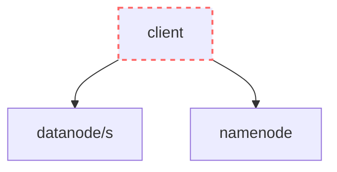

# Building HDFS from scratch with Python

The goal of this lab is to build a distributed file storage system that allows the user to upload and download files, which we will call SSHDFS (Super Simple HDFS).

# Table of contents

- [Required exercises](#required-exercises)
    - [Seminar 1: Introduction to HDFS and APIs](#seminar-1-introduction-to-hdfs-services-and-apis)
    - [Lab 1: Building the namenode](#lab-1-building-the-namenode)
    - [Lab 2: Building the datanode](#lab-2-building-the-datanode)
    - [Seminar 2: Building a Python client](#seminar-2-building-a-python-client)

- [Design](#design)
    - [client](#client)
    - [namenode](#namenode)
    - [datanode](#datanode)

- [Additional exercises](#additional-exercises)

# Required exercises

Remember you must format your code with black and follow PEP8 conventions.

## Seminar 1: Introduction to HDFS, services and APIs

### [S1Q0] [5 marks] Answer the following questions about distributed systems.

> [!TIP]
> Answer each question briefly (at most, 2 sentences per question).

**[1 mark] What is the difference between a server and a service?**

**[1 mark] What is the difference between horizontal and vertical scaling?**

**[1 mark] What does availability mean?**

**[1 mark] What does durability mean?**

**[1 mark] To improve the availability of a service, would you recommend vertical or horizontal scaling?**

---

### [S1Q1] [10 marks] Answer the following questions about HDFS.

> [!TIP]
> Answer each question briefly (at most, 2 sentences per question).

**[1 mark] What are files divided into?**

**[1 mark] Are all blocks the same size?**

**[1 mark] How many instances of the `namenode` can run in HDFS?**

**[1 mark] Does the `namenode` scale horizontally or vertically? How does it impact availability?**

**[1 mark] How many instances of the `datanode` can run in HDFS?**

**[1 mark] Does the `datanode` scale horizontally or vertically? How does it impact availability?**

**[1 mark] Take a look at [Uploading files](#uploading-files). What is the main difference when writing a file to SSHDFS when compared to HDFS in relation to replication?**

**[1 mark] How is the image constructed from the journal (WAL) and checkpoint?**

**[1 mark] Take a look at [namenode](#namenode-filesystem). Does SSHDFS have a journal? What is the main problem with this approach?**

**[1 mark] How does the replication factor impact durability?**

---

### [S1Q2] [5 marks] Answer the following questions about TCP, HTTP and APIs.

> [!TIP]
> Answer each question briefly (at most, 2 sentences per question).

**[1 mark] What is the difference between TCP and UDP?**

**[1 mark] What is HTTP? Is HTTP based on TCP or UDP?**

**[1 mark] What is an API?**

**[1 mark] Watch [RESTful APIs in 100 Seconds](https://www.youtube.com/watch?v=-MTSQjw5DrM) and/or [What is a REST API?](https://www.youtube.com/watch?v=-mN3VyJuCjM). What is an HTTP API? What is an HTTP REST API?**

**[1 mark] What 4 verbs does an HTTP API use for representing the actions of reading, updating, deleting and creating?**

---

### [S1Q3] [5 marks] Answer the following questions about Docker.

> [!TIP]
> Answer each question briefly (at most, 2 sentences per question).

**[1 mark] Watch [Docker in 100 Seconds](https://www.youtube.com/watch?v=Gjnup-PuquQ). What is a Dockerfile?**

**[1 mark] What is a Docker image?**

**[1 mark] What is a Docker container?**

**[1 mark] What is Docker compose?**

**[1 mark] What is a Docker compose file?**

---

### [S1Q4] [5 marks] Build your first HTTP API

Inside the folder [projects\1-hdfs\testserver1](./testserver1/), follow the [Fastapi quickstart](https://fastapi.tiangolo.com/#installation) tutorial to build a service with an HTTP API.

**[1 mark] Paste a screenshot where you do a GET request to your service using the browser. Open `http://127.0.0.1:8000/items/512?q=lsds25`.**.

**[1 mark] Paste a screenshot where you do the same GET request to your service but using `curl` in the terminal. Run `curl -X GET http://127.0.0.1:8000/items/835?q=lsds25`.**

**[2 marks] Implement a new endpoint of your API: `POST /sum`.** 

The endpoint must receive a [JSON object with two numbers in the body](https://fastapi.tiangolo.com/tutorial/body/) and return the sum.

```
POST http://127.0.0.1:8000/sum
```

Body:
```json
{
    "x": 23,
    "y": 32
}
```

Response:
```json
{
    "result": 55
}
```

**[1 mark] Paste a screenshot where you test the POST request to your service using `curl`. Run `curl -X POST http://127.0.0.1:8000/sum -H "Content-Type: application/json" -d '{"x":23, "y": 32}'` in the terminal**

---

### [S1Q5] [5 marks] Dockerizing a service

Inside the folder [projects\1-hdfs\testserver2](./testserver2/), follow the [Fastapi in Containers - Docker](https://fastapi.tiangolo.com/deployment/docker/) tutorial.

**[2 mark] Paste a screenshot where you test the API of your service running in Docker using `curl`.**

Go back to [projects\1-hdfs\testserver1](./testserver1/). Adapt it so it runs in Docker.

**[3 mark] Paste a screenshot where you test the `sum` endpoint of your API running in Docker using `curl`.**

---

## Lab 1: Building the namenode

During this lab session, you must build the `namenode` service as described in [namenode](#namenode).

Create a basic FastAPI service in [projects\1-hdfs\namenode](./namenode/) that can be dockerized like [projects\1-hdfs\testserver2](./testserver2/). 

```
/namenode
    requirements.txt
    main.py
    Dockerfile
    config.json
    files.json
```

### [L1Q0] [5 marks] GET /datanodes

In the `config.json` file, write a [JSON object with 3 data nodes](#namenode-filesystem).

Then, implement the first endpoint of the `namenode` API: [GET /datanodes](#get-datanodes). Your code must [read](https://python.land/data-processing/working-with-json#How_to_read_a_JSON_file_in_python) the configured `datanodes` from the `config.json` file and return them.

Test it works with curl and paste a screenshot.

---

### [L1Q1] [15 marks] POST /files

Implement the [POST /files](#post-files) endpoint. 

When a new file is created, you must return the number of blocks and the datanode where they need to be stored by the client:

- [Read](https://python.land/data-processing/working-with-json#How_to_read_a_JSON_file_in_python) the [number of replicas, `datanodes` and block size from `config.json`](#namenode-filesystem).

- Read the file size and file name from the [request body](https://fastapi.tiangolo.com/tutorial/body/).

- Compute the number of blocks and assign them to `datanodes` using the [modulo-based policy](#block-and-replica-placement)

- [Write](https://python.land/data-processing/working-with-json#How_to_write_JSON_to_a_file_in_python) the [metadata of the new file to `files.json`](#namenode-filesystem) whenever a new file is created. 

Test it works with curl and paste a screenshot. Verify the new file is also stored to `files.json` and paste a screenshot.

---

### [L1Q2] [10 marks] GET /files/{filename}

Implement the [GET /files/{filename}](#get-filesfilename) endpoint. 

[Read the file name being requested from the URL path](https://fastapi.tiangolo.com/tutorial/path-params/). Then [read](https://python.land/data-processing/working-with-json#How_to_read_a_JSON_file_in_python) the file metadata stored in `files.json`.  Finally, return it.

Test it works with curl and paste a screenshot.

Make sure you return a 404 if the file is not found in `files.json`.

---

### [L1Q3] [5 marks] Deploying the namenode using docker-compose

Docker compose allows us to easily build Docker and run services. Read the [Docker Compose Quickstart](https://docs.docker.com/compose/gettingstarted/).

Create a new `compose.yaml` file with your namenode service

```yaml
services:
  namenode:
    build: namenode
    ports:
      - "8000:80"
```
Start the service: `docker compose up`.

Test you can create a file and get a file with curl and paste a screenshot.

Also, paste a screenshot of the content of the `files.json` file using the `Files` tab in `Docker Desktop` to explore the files inside the container.

---

## Lab 2: Building the datanode

During this lab session, you must build the `datanode` service as described in [datanode](#datanode).

Create a basic FastAPI service in [projects\1-hdfs\datanode](./datanode/) that can be dockerized like the [projects\1-hdfs\namenode](./namenode/).

```
/namenode
    requirements.txt
    main.py
    Dockerfile
    config.json
    files.json
/datanode
    requirements.txt
    main.py
    Dockerfile
    /storage
compose.yaml
```

---

### [L2Q0] [10 marks] PUT /files/{filename}/blocks/{block_number}/content

Implement the [PUT /files/{filename}/blocks/{block_number}/content](#put-filesfilenameblocksblock_numbercontent) endpoint. When a new block is PUT, you must [read the file name and block number from the URL path](https://fastapi.tiangolo.com/tutorial/path-params/). Then, the `datanode` must [store it in its file system](#datanode-filesystem) at the path `datanode/storage/<filename>/<block_number>`.

> [!TIP]
> You can [use the `UploadFile` object to receive files](https://fastapi.tiangolo.com/tutorial/request-files/#define-file-parameters).

> [!TIP]
> You can use the [`open` and `write`](https://www.geeksforgeeks.org/python-write-bytes-to-file/) functions to write bytes to a new file. 

Test you can upload a file as if it were a single block with curl: `curl -F "file=@./test_files/cat.jpg" -X PUT localhost:8001/files/cat.jpg/blocks/0/content`. Paste a screenshot of putting a block to the datanode with curl and how it is stored in the filesystem inside the container (using the `Files` tab in `Docker Desktop`).

---

### [L2Q1] [10 marks] GET /files/{filename}/blocks/{block_number}/content

Implement the [GET /files/{filename}/blocks/{block_number}/content](#get-filesfilenameblocksblock_numbercontent) endpoint. Read the file name and block number [from the URL path](https://fastapi.tiangolo.com/tutorial/path-params/). When a block is GET, the `datanode` must read it from [its file system](#datanode-filesystem) at the path `datanode/storage/<filename>/<block_number>`. 
    
> [!TIP]
> You can [use the `FileResponse` object to return files](https://fastapi.tiangolo.com/advanced/custom-response/#fileresponse).

Test you can download the cat image we uploaded before with curl: `curl -o downloaded-cat.jpg -X GET localhost:8001/files/cat.jpg/blocks/0/content`. Paste a screenshot and verify the downloaded image is fine.

---

### [L2Q2] [5 marks]. Deploying the datanode with docker compose

Modify the `compose.yaml` file to also create 3 `datanodes` services at ports 8001, 8002 and 8003.

Test you can upload and download the cat image when the service runs in Docker. Paste a screenshot and verify the downloaded image is fine.

---

## Seminar 2: Building a Python client

During this seminar, you must build the [Python client](#client) which allows uploading and download files as blocks from SSHDFS.

### [S2Q0] [5 marks] List datanodes

Create a new Python script `projects\1-hdfs\client\list_datanodes.py` that retrieves all the `datanodes` from the `namenode` and prints the URLs:
- Retrieve the host and port of each `datanode` dynamically [using the `namenode` API](#get-datanodes). 
- Then, print the result nicely.

> [!TIP]
> The equivalent of `curl` in Python is the `requests` module. To make a GET request in Python, [use the `requests.get` function](https://stackoverflow.com/a/17517598).

Run the `list_datanodes.py` script and paste a screenshot of the result.

---

### [S2Q1] [10 marks] Upload a file

Create a new Python script `projects\1-hdfs\client\upload.py` that asks the user for a file path, creates a new file in the `namenode` and uploads each block (and each replica) to the `datanodes` that the `namenode` assigned:
- Ask the user for a path using `input`. 
- Ask the user for a filename using `input`. 
- [Check the file size](https://stackoverflow.com/questions/2104080/how-do-i-check-file-size-in-python)
- Create the file using the [POST /files](#post-files) endpoint in the `namenode` API.

> [!TIP]
> The equivalent of `curl` in Python is the `requests` module. To make a POST request in Python, [use the `requests.post` function](https://stackoverflow.com/a/26344315). 

- Read [the bytes of the file](https://stackoverflow.com/questions/1035340/reading-binary-file-and-looping-over-each-byte) block by block. 
- Finally, PUT each block and each replica to the assigned `datanode`.

> [!TIP]
> In Python, you can use the `requests.put` with the `files` parameter to upload some binary content.
>
>```python
>import requests
>requests.put(url, files={
>    'file': block_as_bytes
>})
>```  

Run the `upload.py` script and paste a screenshot of the result and how the blocks are stored in the different `datanodes` (inside Docker).

---

### [S2Q2] [10 marks] Download a file

Create a new Python script `projects\1-hdfs\client\download.py` that asks the user for a filename, a destination path, downloads all the blocks from the `datanodes` and writes them all together to the destination path as the complete file:
- Ask the user for a filename using `input`.
- First, retrieve the file metadata using the [GET /files/{filename}](#get-filesfilename) endpoint of the `namenode` API. 
- Then, use the [GET /files/{filename}/blocks/{block}/content](#get-filesfilenameblocksblock_numbercontent) endpoint of the `datanode` API to download each block from one of the replicas.
- Finally, [write all blocks as one final file](https://www.geeksforgeeks.org/python-write-bytes-to-file/).

> [!TIP]
> In Python, you can use the `requests.get` with the `content` method to download some binary content.
>
>```python
>import requests
>block_as_bytes = requests.get(url).content
>```  


Run the `upload.py` and `download.py` scripts. Paste a screenshot of how you can upload and download files.

---


# Design

> [!NOTE]
> This section outlines the requirements and design decisions of the SSHDFS architecture. You must implement a system that matches this design using Python.

> [!TIP]
> SSHDFS is a simplified version of HDFS. Read and study [The Hadoop Distributed File System paper](https://ieeexplore.ieee.org/document/5496972) first to make sure you have a good understanding of the system.

SSHDFS is composed of 2 services and 1 client:
- The [**client**](#client) allows the user to upload and download files from SSHDFS.
- The [**datanode** service](#datanode) stores blocks.
- The [**namenode** service](#namenode) stores which blocks compose a file and which `datanode` has each block.

The following diagram represents the dependencies in the system. For example, `client --> datanode` indicates that `client` depends on `datanode` (`client` uses the API of `datanode`).



### client

In SSHDFS, files are divided into blocks before being stored. A block is a chunk of the file. For example, if we configure the block size of SSHDFS as 100 bytes, then to store a file that weights 295 bytes we will divide the file in 3 blocks: block 1 (0 - 100 bytes), block 2 (100 - 200 bytes) and block 3 (200 - 295 bytes).

#### Uploading files

To upload a file, the client first creates the file in the `namenode`. Then, it divides the file into blocks and sends each block to the corresponding `datanode`. 

If the `namenode` is configured with a `replication_factor` higher than 1, then the client sends each block to the corresponding `datanode`. In other words, there is no write pipelines in SSHDFS (compared to HDFS).

#### Downloading files

To download a file, the client fetches each blocks from the corresponding `datanode`. Then, it reassembles the original file by writing the blocks to a new file in the correct order.

### namenode

In SSHDFS, there is exactly 1 instance of the `namenode` in the system. I.e., the `namenode` is scaled vertically.

In order for the `client` to create or retrieve a file from SSHDFS, the `namenode` exposes an HTTP REST API. The API for the `namenode` only allows three operations:
- [Get a list of datanodes in the system](#get-datanodes)
- [Create a new file](#post-files)
- [Get the information from an existing file](#get-filesfilename)

#### namenode filesystem

The namenode stores all its data in two files: `config.json` and `files.json`.

The `namenode` reads the `config.json` file to get the system configuration, including the datanodes, replication factor and block size (in bytes).

```json
{
    "datanodes": [
        {
            "host": "localhost",
            "port": 8001
        },
        {
            "host": "localhost",
            "port": 8002
        },
        {
            "host": "localhost",
            "port": 8003
        }
    ],
    "replication_factor": 2,
    "block_size": 1000000
}
```


The `namenode` writes to the `files.json` file every file that is created in the system. At the beginning, the `files.json` file is an empty object (`{}`). But when a client creates a file, the `namenode` stores the file metadata like in the following example. 

```json
{
    "cat.jpg": {
        "file_name": "cat.jpg",
        "size": 295,
        "blocks": [
            {
                "number": 0,
                "size": 100,
                "replicas": [
                    {
                        "host": "localhost",
                        "port": 8001
                    }
                ]
            },
            {
                "number": 1,
                "size": 100,
                "replicas": [
                    {
                        "host": "localhost",
                        "port": 8002
                    }
                ]
            },
            {
                "number": 2,
                "size": 95,
                "replicas": [
                    {
                        "host": "localhost",
                        "port": 8003
                    }
                ]
            }
        ]
    },
    "somefile.txt": {
        "file_name": "somefile.txt",
        "size": 95,
        "blocks": [
            {
                "number": 0,
                "size": 95,
                "replicas": [
                    {
                        "host": "localhost",
                        "port": 8001
                    }
                ]
            }
        ]
    }
}
```

If the `replication_factor` of the system is higher than one, the `replicas` array stores the host and port of each `datanode` that has a replica of the block. Otherwise, the `replicas` array contains a single `datanode` object (with its host and port).

#### GET /datanodes

The client can retrieve all `datanodes` configured in SSHDFS using the `datanodes` endpoint.

For example, the `client` can retrieve all `datanodes` configured in the `namenode` with address `localhost:8000` as follows:

```
GET http://localhost:8000/datanodes
```

Response:
```json
{
    "datanodes": [
        {
            "host": "localhost",
            "port": 8001
        },
        {
            "host": "localhost",
            "port": 8002
        },
        {
            "host": "localhost",
            "port": 8003
        }
    ]
}
```

#### POST /files

POSTing to `/files` creates a new file in the `namenode`.  When a file is created, the response from the `namenode` contains the information of where the file must be stored.

For example, the `client` can create a file called `myfile.jpg` that weights 295 bytes to the `namenode` with address `localhost:8000` (configured with a replication factor of 2) as follows:

```
POST http://localhost:8000/files
```

Body:
```json
{
    "file_name": "myfile.jpg",
    "size": 295
}
```

Response:
```json
{
    "file_name": "myfile.jpg",
    "size": 295,
    "blocks": [
        {
            "number": 0,
            "size": 100,
            "replicas": [
                {
                    "host": "localhost",
                    "port": 8001
                },
                {
                    "host": "localhost",
                    "port": 8002
                }
            ]
        },
        {
            "number": 1,
            "size": 100,
            "replicas": [
                {
                    "host": "localhost",
                    "port": 8002
                },
                {
                    "host": "localhost",
                    "port": 8003
                }
            ]
        },
        {
            "number": 2,
            "size": 95,
            "replicas": [
                {
                    "host": "localhost",
                    "port": 8003
                },
                {
                    "host": "localhost",
                    "port": 8001
                }
            ]
        }
    ]
}
```

##### block and replica placement

In SSHDFS, we will use a very simple block and replica placement strategy.

The first block of a file will always be stored in datanode 1. Then, all the following blocks will be assigned using the modulo operator: `datanode_index = (block_number % total_datanodes)`.

For example, consider a system with 3 `datanodes`, `block_size=100` and `replication_factor=1`. Then, if a client wants to store a file that weights 495 bytes:
- File is divided in 5 blocks: block 1 (0 - 100 bytes), block 2 (100 - 200 bytes), block 3 (200 - 300 bytes), block 4 (300 - 400 bytes) and block 5 (400 - 495 bytes)
- We assign each block to a datanode using the modulo operation:
    - block 1 replica 1 (datanode 1)
    - block 2 replica 1 (datanode 2)
    - block 3 replica 1 (datanode 3)
    - block 4 replica 1 (datanode 1)
    - block 5 replica 1 (datanode 2)

To place replicas, we will use a similar logic. Each replica will be placed to the next `datanode`: `datanode_index = ((first_replica_datanode_index + replica_number) % total_datanodes)`.

For example, consider a system with 3 `datanodes`, `block_size=100` and `replication_factor=2`. Then, if a client wants to store a file that weights 295 bytes:
- File is divided in 3 blocks: block 1 (0 - 100 bytes), block 2 (100 - 200 bytes), block 3 (200 - 295 bytes)
- We assign each block and replica to a datanode using the modulo operation:
    - block 1 replica 1 (datanode 1), block 1 replica 2 (datanode 2)
    - block 2 replica 1 (datanode 2), block 2 replica 2 (datanode 3)
    - block 3 replica 1 (datanode 3), block 3 replica 2 (datanode 1)


#### GET /files/{filename}

GETting `/files/{filename}` retrieves the file metadata from the `namenode`. 

For example, the `client` can retrieve all the information about a file called `myfile.jpg` from the `namenode` with address `localhost:8000` as follows:

```
GET http://localhost:8000/files/myfile.jpg
```

Response:
```json
{
    "file_name": "myfile.jpg",
    "size": 295,
    "blocks": [
        {
            "number": 0,
            "size": 100,
            "replicas": [
                {
                    "host": "localhost",
                    "port": 8001
                }
            ]
        },
        {
            "number": 1,
            "size": 100,
            "replicas": [
                {
                    "host": "localhost",
                    "port": 8002
                }
            ]
        },
        {
            "number": 2,
            "size": 95,
            "replicas": [
                {
                    "host": "localhost",
                    "port": 8002
                }
            ]
        }
    ]
}
```

If the file does not exist in the `namenode`, the response must be a 404.

### datanode

In SSHDFS, there are many instances of the `datanode`. I.e., the `datanode` is scaled horizontally.

In order for the `client` to upload and download blocks from the `datanode`, the `datanode` exposes an HTTP API. The API for the `datanode` only allows two operations:
- [Upload a block](#put-filesfilenameblocksblock_numbercontent)
- [Download a block](#get-filesfilenameblocksblock_numbercontent)

#### datanode filesystem

When a block is stored in a `datanode` server, the block is persisted to the file system. Blocks are persisted to the path `datanode/storage/<filename>/<block_number>`. In other words, we create one folder with the name of each file the `datanode` stores, and we store the blocks inside the folder, each in a file with the block number as its name (without extension). For example, the file system of a `datanode` that stores blocks 0 and 23 of the file `cat1.jpg`, block 5 of the file `cat29.jpg` and blocks 2 and 22 of the file `cat3.jpg` looks as follows:
```
/datanode
    /storage
        /cat1.jpg
            0
            23
        /cat3.jpg
            2
            22
        /cat29.jpg
            5
``` 

#### PUT /files/{filename}/blocks/{block_number}/content

PUTting a block to `/files/{filename}/blocks/{block_number}/content` uploads it to the `datanode`. 

For example, to upload the block `0` of a file named `myfile.jpg` in the `datanode` with address `localhost:8001`, the `client` must send a request with the block [attached as a file](https://api4.ai/blog/how-to-post-a-file-via-http-request) to `PUT http://localhost:8001/files/myfile.jpg/blocks/0/content`.

#### GET /files/{filename}/blocks/{block_number}/content

GETting a block from `/files/{filename}/blocks/{block_number}/content` downloads it from the `datanode`. 

For example, to download the block `0` of a file named `myfile.jpg` from the `datanode` with address `localhost:8001`, the `client` must send a request to `GET http://localhost:8001/files/myfile.jpg/blocks/0/content`.


# Additional exercises

You can earn an additional 2 marks (over 10) on this project's grade by working on additional exercises. To earn the full +2, you need to complete 4 additional exercises. 

### [AD0Q0] Build a unified client with click

Use the [click](https://click.palletsprojects.com/en/8.1.x/) library to create a unified client with different commands for: `upload`, `download` and `info`.


### [AD0Q1] Writing one automated test

Use [pytest](https://docs.pytest.org/en/8.2.x/) to create one automated test that checks we can upload and download files from SSHDFS. Compare the checksums of the file to verify the downloaded file is intact.


### [AD0Q2] Reporting block status to namenode

Use [rocketry](https://rocketry.readthedocs.io/en/stable/cookbook/fastapi.html) to report the blocks that each `datanode` has every 30 seconds to the `namenode`:
- Add an endpoint in the API of the `namenode` that allows removing a file.
- Add an endpoint in the API of the `namenode` to receive the block reports.
- The `datanode` should then copy all blocks that have been indicated for addition by the `namenode` from another datanode that has a replica.


### [AD0Q3] Implement write pipelines

Instead of having the client PUT each replica to each `datanode` one by one, PUT it only to the first replica. Then, the `datanode` writes it to the next one in the pipeline.


### [AD0Q4] Analyzing parameters

Compare how different replication factors impact upload speed. Analyze the impact of AD0Q3.

Compare how different replication factors impact download speed with many download requests. What if the client chooses a random replica (instead of the first one)?

Use [matplotlib](https://matplotlib.org/) to plot the results.

### [AD0Q5] Detecting corrupted files

_Depends on: AD0Q2_

Store the block hash next to each block in the `datanode` file system. Every 30 seconds, compute the hash of existing blocks to check if any of the blocks have been corrupted or modified. When a block hash does not match, report it as missing in the block report and retrieve it from a replica in another `datanode` provided in the `namenode` response.


### [AD0Q6] Discuss the namenode implementation

Describe the main issues with the proposed `namenode` implementation and suggest improvements.


### [AD0Q7] Migrate to Docker volumes

Persistent data, such as the `storage` folder in the `datanodes`, should use [Docker volumes](https://docs.docker.com/storage/volumes/). This allows replacing or restarting a `datanode` without loosing the stored data.

Modify the Docker compose file to [use volumes for the `storage` folder](https://docs.docker.com/compose/compose-file/07-volumes/) of `datanodes`. 

Modify the Docker compose file to [use volumes for the `files.json` file](https://docs.docker.com/compose/compose-file/07-volumes/) of the `namenode`.


### [AD0Q8] Introduce a datanode id

Update `config.json` with an `id` field for each `datanode`. The id must be a [uuid4](https://www.uuidgenerator.net/). Then, in `files.json`, store only the id of the `datanode` for each replica, instead of repeating the `host` and `port` over and over. Finally, adapt the `namenode` implementation so the API continues to work without changes.

### [AD0Q9] Design and implement a smarter block and replica placement strategy

The simple block placement strategy we use (always start with the first `datanode` and assign using modulo) can lead to unbalanced `datanodes`.

Design a block (and replica) placement strategy that considers how many blocks each `datanode` already has, such that blocks are distributed uniformly. Explain and implement the improved placement strategy in `namenode`.


### [AD0Q10] Extend the client to check for file integrity

Extend the `upload.py` client to also send the hash of the file. Then, store the file hash in the `files.json` and expose it in the `namenode` API. Finally, when the `download.py` client retrieves all the blocks and reconstructs the file, check that the hash matches the expected one. If the hash does not match (e.g. a block was corrupted), print an error.


### [AD0Q11] Implement a mechanism for AuthN

Implement a mechanism that only allows clients with a valid token to create files, upload and download files. This should be similar to the HDFS block token, but using JWTs instead.


### [AD0Q12] Implement a mechanism for AuthZ

Extend the NN API to allow creating roles and creating files that only some roles can read. Then, enforce them when a client tries to read or write by extending AD0Q11.

### [AD0Q13] Implement deleting blocks

Extend the APIs and client scripts to allow deleting files.

### [AD0Q14] Improve the current namenode storage

Replace the single file with a journal and a checkpoint.
