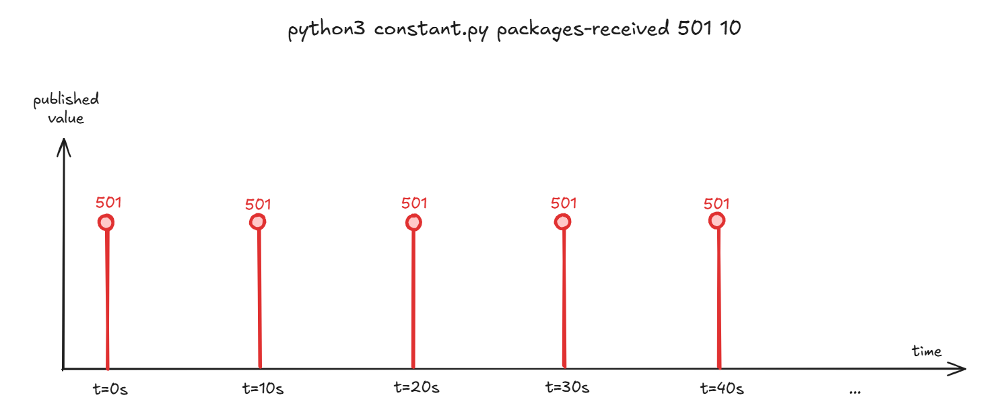
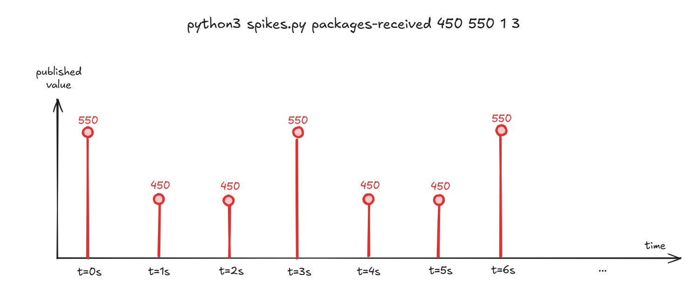
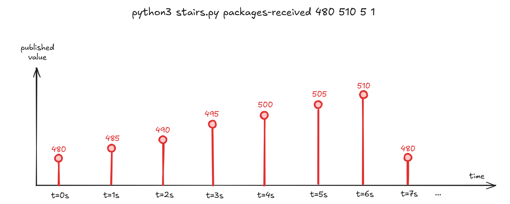
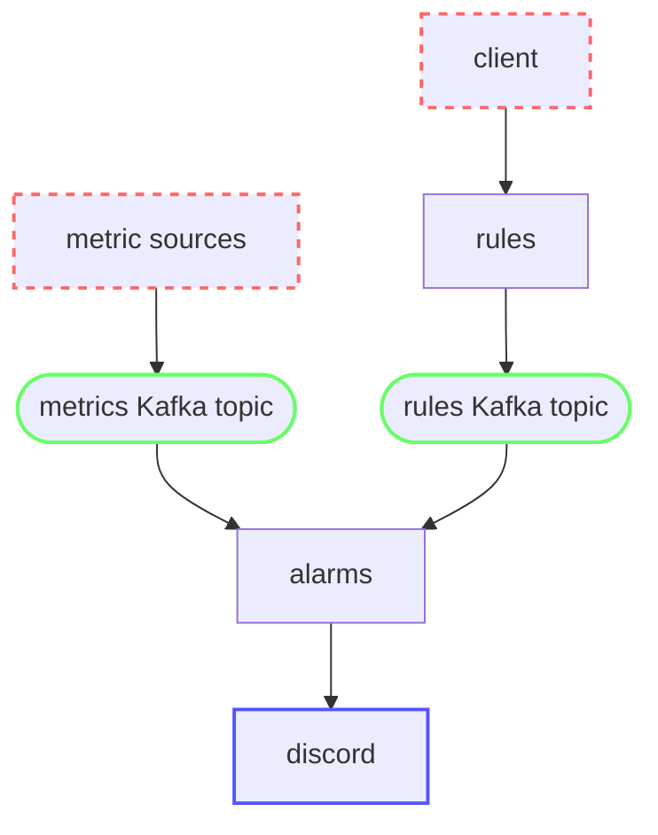
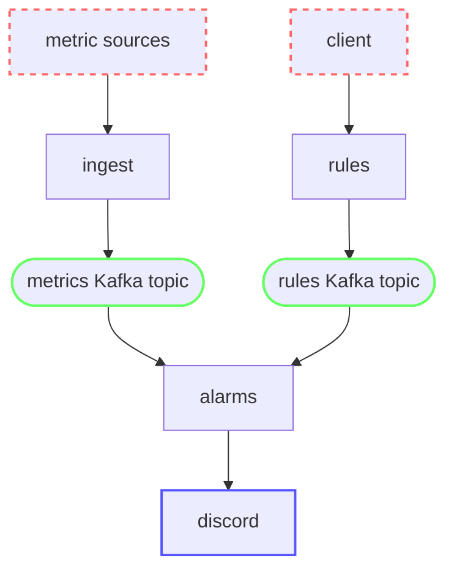

# Building a realtime monitoring system

Engineers at Acme Inc. are suffering many incidents and outages. During these outages, their services go down and customers cannot use the website and other services they offer. They want to start publishing metrics from their servers such as CPU usage, failure count, memory usage, request count, packages received in their warehouses, etc. Then, they wish to leverage some service which can help them define rules and trigger alerts. For example, send a Discord message with an alarm when the CPU usage is above 80%. They hope if they get an alert in realtime about any issues in their services, they will be able to fix them quickly before there is customer impact.

You need to build said realtime monitoring system which:
- **reads all the metrics from the sources in realtime** 
- allow engineers to **create and delete rules** using an API. For example: trigger an alarm when `cpu-usage-server-124` is above `90`.
- **send alarms in real-time to a Discord channel**. For example: send a Discord message when the `cpu-usage-server-124 > 90` rule is triggered.

We will call this system Super Simple Realtime Monitoring System (SSRMS). You can check out the [SSRMS demo video](https://www.youtube.com/watch?v=yuPLcAdw5SQ) to better understand how your system must work when you finish the lab.

# Table of contents

- [Required exercises](#required-exercises)
    - [Seminar 5: Producing metrics to Kafka](#seminar-5-producing-metrics-to-kafka)
    - [Lab 5: Building the rules service](#lab-5-building-the-rules-service)
    - [Lab 6: Building the alarms service](#lab-6-building-the-alarms-service)

- [Design](#design)
    - [rules service](#rules-service)
    - [alarms service](#alarms-service)

- [Additional exercises](#additional-exercises)

# Required exercises

Remember you must format your code with black and follow PEP8 conventions.

## Seminar 5: Producing metrics to Kafka

During this seminar session, you must create scripts that simulate the devices publishing metrics to Kafka.

### [S5Q0] [7 marks] Answer the following questions about Kafka.

> [!TIP]
> Answer each question briefly (at most, 3 sentences per question).

**[1 mark] What is a log? What is a topic? What is a partition?**

**[1 mark] What does the broker do? What is a producer? And a consumer?**

**[1 mark] What is a consumer group? What is a commit?**

**[1 mark] Is ordering guaranteed in Kafka?**

**[1 mark] What is the upper boundary when horizontally scaling Kafka consumers for a single topic?**

**[1 mark] Does each `alarms` service process only one metrics type or many?**

**[1 mark] Can two metrics of the same type end up in two different `alarms` services?**

---

### [S5Q1] [8 marks] Answer the following questions about Kafka compacted topics and materialized views.

> [!TIP]
> Answer each question briefly (at most, 3 sentences per question).

**[1 mark] What is the difference between a standard topic and a compacted topic?**

**[1 mark] What is a materialized view? Why do we use compacted topics to create materialized views?**

**[1 mark] If multiple horizontally scaled consumers want to each construct a materialized view of the full topic, must they be in the same or different consumer groups?**

**[1 mark] If multiple horizontally scaled consumers want to each construct a materialized view of the full topic, what are the benefits of having more than 1 partition?**

**[1 mark] What record represents a key deletion for a Materialzied View in a Kafka topic?**

**[3 mark] What is the benefit of a materialized view over an in-memory cache?**

---

### [S5Q2] [5 marks] Create Kafka topics

The [compose.kafka.yaml](./compose.kafka.yaml) file has a full Kafka deployment with 1 broker. 

Start the Kafka cluster with `docker compose -f compose.kafka.yaml up`.

Use the Kafka CLI to create two topics: `metrics` (standard) and `rules` (compacted):

```zsh
docker exec -it kafka-cluster-kafka-1-1 /bin/sh

/bin/kafka-topics --bootstrap-server kafka-1:9092 --create --topic metrics --partitions 20 --replication-factor 1
/bin/kafka-topics --bootstrap-server kafka-1:9092 --create --topic rules --partitions 3 --replication-factor 1 --config cleanup.policy=compact

/bin/kafka-topics --bootstrap-server kafka-1:9092 --list

exit
```

Paste a screenshot.

---

### [S5Q3] [5 marks] Implement the constant source emulator

Inside the [projects\3-kafka\sources](./sources/) folder, create a Python script `constant.py`.

This script should be called with 3 parameters: `metric_name`, `metric_value` and `period_seconds`. Then, it must publish to the `metrics` topic, using `metric_name` as key and `{"value":metric_value}` as value. Then, sleep `period_seconds` and repeat again.

```zsh
python3 constant.py {metric_name} {metric_value} {period_seconds}
```



For example, this is an example command and what it should publish to Kafka (where we represent `key: value`):

```zsh
python3 constant.py packages-received 501 10
```

```
packages-received: {"value": 501}
packages-received: {"value": 501}
packages-received: {"value": 501}
packages-received: {"value": 501}
packages-received: {"value": 501}
...
```
> [!TIP]
> Take a look at [producer.py](./../../resources/kafka-quickstart/producer.py).

Paste a screenshot verifying the metrics are published to Kafka:

```zsh
docker exec -it kafka-cluster-kafka-1-1 /bin/sh

/bin/kafka-console-consumer --bootstrap-server kafka-1:9092 --topic metrics --property print.key=true
```

### [S5Q4] [5 marks] Implement the spikes source emulator

Inside the [projects\3-kafka\sources](./sources/) folder, create a Python script `spikes.py`.

This script should be called with 5 parameters: `metric_name`, `low_value`, `spike_value`, `period_seconds` and `frequency`. Then, it must publish to the `metrics` topic, using `metric_name` as key and `{"value":metric_value}` as value. The value must be `spike_value` every `frequency` records, otherwise `low_value` . Then, sleep `period_seconds` and repeat again.

```zsh
python3 spikes.py {metric_name} {low_value} {spike_value} {period_seconds} {frequency}
```



For example, this is an example command and what it should publish to Kafka (where we represent `key: value`):

```zsh
python3 spikes.py packages-received 450 550 1 3
```

```
packages-received: {"value": 550}
packages-received: {"value": 450}
packages-received: {"value": 450}
packages-received: {"value": 550}
packages-received: {"value": 450}
packages-received: {"value": 450}
...
```

> [!TIP]
> Take a look at [producer.py](./../../resources/kafka-quickstart/producer.py).

Paste a screenshot verifying the metrics are published to Kafka:

```zsh
docker exec -it kafka-cluster-kafka-1-1 /bin/sh

/bin/kafka-console-consumer --bootstrap-server kafka-1:9092 --topic metrics --property print.key=true
```


### [S5Q5] [5 marks] Implement the stairs source emulator

Inside the [projects\3-kafka\sources](./sources/) folder, create a Python script `stairs.py`.

This script should be called with 5 parameters: `metric_name`, `start_value`, `env_value`, `step` and `period_seconds`. Then, it must publish to the `metrics` topic, using `metric_name` as key and `{"value":metric_value}` as value. The value must start at `start_value`, and increment every `period_seconds` by `step` until `end_value`. Them, go back to `start_value` and repeat again.

```zsh
python3 stairs.py {metric_name} {metric_value} {start_value} {end_value} {step} {period_seconds}
```



For example, this is an example command and what it should publish to Kafka (where we represent `key: value`):

```zsh
python3 stairs.py packages-received 480 510 5 1
```

```
packages-received: {"value": 480}
packages-received: {"value": 485}
packages-received: {"value": 490}
packages-received: {"value": 495}
packages-received: {"value": 500}
packages-received: {"value": 505}
packages-received: {"value": 510}
packages-received: {"value": 480}
packages-received: {"value": 485}
packages-received: {"value": 490}
packages-received: {"value": 495}
packages-received: {"value": 500}
packages-received: {"value": 505}
packages-received: {"value": 510}
...
```

> [!TIP]
> Take a look at [producer.py](./../../resources/kafka-quickstart/producer.py).

Paste a screenshot verifying the metrics are published to Kafka:

```zsh
docker exec -it kafka-cluster-kafka-1-1 /bin/sh

/bin/kafka-console-consumer --bootstrap-server kafka-1:9092 --topic metrics --property print.key=true
```


## Lab 5: Building the rules service

During this lab session, you must build the `rules` service as described in [rules service](#rules-service).

Inside the [projects\3-kafka\rules](./rules/) folder, create a [Fastapi service with Docker](https://fastapi.tiangolo.com/deployment/docker/).

```
/rules
    requirements.txt
    main.py
    Dockerfile
```

### [L5Q0] [20 marks] POST /rules

Implement the first endpoint of the `rules` API: [POST /rules](#post-rules).

**[10 marks] Implement the [POST /rules](#post-rules) endpoint**.

> [!TIP]
> Use the [`uuid.uuid4()`](https://stackoverflow.com/questions/534839/how-to-create-a-guid-uuid-in-python) method to generate the rule id.


**[10 marks] For every created rule, [publish it to the `rules` Kafka topic](https://docs.confluent.io/kafka-clients/python/current/overview.html#initialization)**.

> [!TIP]
> Take a look at [kafka-quickstart](./../../resources/kafka-quickstart/) for a sample.

Paste a screenshot of how you use `curl` to POST a rule and it is published to the Kafka topic:

```zsh
docker exec -it kafka-cluster-kafka-1-1 /bin/sh

/bin/kafka-console-consumer --bootstrap-server kafka-1:9092 --topic rules --property print.key=true
```


---

### [L5Q1] [20 marks] DELETE /rules/{id}

Implement the other endpoint of the `rules` API: [DELETE /rules/{id}](#delete-rulesid).

**[10 marks] Implement the [DELETE /rules/{id}](#delete-rulesid) endpoint**.

**[10 marks] For every deleted rule, [publish it to the `rules` Kafka topic with a null body](https://docs.confluent.io/kafka-clients/python/current/overview.html#initialization)**.

Paste a screenshot of how you use `curl` to DELETE a rule and null is published to the Kafka topic:

```zsh
docker exec -it kafka-cluster-kafka-1-1 /bin/sh

/bin/kafka-console-consumer --bootstrap-server kafka-1:9092 --topic rules --property print.key=true
```

### [L5Q2] [5 marks] Dockerizing the rules service

Add 1 instance of the `rules` service to the [compose.yaml](./compose.yaml) file.

```yaml
services:
  rules:
    build: rules
    ports:
      - "5001:80"
    networks:
      - kafka-cluster_kafka-cluster-network
    environment:
      BROKER: kafka-1:9092
```

Start the services:
```zsh
docker compose up --build
```

Verify and paste a screenshot of how when you POST and DELETE rules with `curl`, the correct records are published to Kafka.

```zsh
docker exec -it lsds-kafka-lab-kafka-1-1 /bin/sh
/bin/kafka-console-consumer --bootstrap-server kafka-1:9092 --topic rules --property print.key=true
```

---

## Lab 6: Building the alarms service

During this lab session, you must build the `alarms` service as described in [alarms service](#alarms-service).

Inside the [projects\3-kafka\alarms](./alarms/) folder, create an empty `main.py` file with a Dockerfile and requirements.txt.

```
/alarms
    requirements.txt
    main.py
    Dockerfile
```

---

### [L6Q0] [15 marks] Create the materialized view of rules

Use a [Kafka consumer](https://docs.confluent.io/kafka-clients/python/current/overview.html#ak-consumer) to consume the `rules` topic from the beginning and create a materialized view in memory with a dictionary.

When it works, [launch it in a background thread](https://stackoverflow.com/questions/2905965/creating-threads-in-python) so it can keep getting updates while we process metrics.

---

### [L6Q1] [15 marks] Consume metrics and match rules

Use a [Kafka consumer](https://docs.confluent.io/kafka-clients/python/current/overview.html#ak-consumer) to consume the `metrics` topic. For each received value, check if any of the rules in the materialized view trigger alarms.

---

### [L6Q2] [15 marks] Sending alarms to Discord

When a rule is triggered, use the `discord_webhook_url` to [send an alarm message to Discord](#sending-messages-to-discord).

---

### [L6Q3] [5 marks]. Deploying the alarms service with docker compose

Add 3 replicas of the `alarms` service to the [compose.yaml](./compose.yaml) file.

---

### [L6Q4] [5 marks]. Testing the system

Deploy the full system with Docker: `docker compose up --build`

Create different rules with the rules API and start producing metrics with the [emulated sources](./sources/). 

**[3 mark] Paste screenshots of how you receive the alarms in Discord.**

**[1 mark] How are `metrics` distributed between alarm containers?**

**[1 mark] What happens if you suddenly stop one of alarm service instances?**


---

# Design

> [!NOTE]
> This section outlines the requirements and design decisions of the architecture of SSRMS. You must implement a system that matches this design using Python.

> [!TIP]
> SSRMS system uses Kafka extensively. Read and study the [Kafka: a Distributed Messaging System for Log Processing](https://www.microsoft.com/en-us/research/wp-content/uploads/2017/09/Kafka.pdf?msockid=01dc1031619a67bb08ec049760dd66cc) paper.

SSRMS is composed of 2 services, metric sources and clients:
- The [**sources**](#sources) send metrics into the system. For example, sensors, devices, and other services.
- The [**clients**](#clients) (Operation Engineers at Nozama) use the Rules API to create and update rules in the system.
- The [**rules** service](#rules-service) allows users to create and update alarm rules through the API and stores them in the `rules (compacted) topic`.
- The [**alarms** service](#alarms-service) creates a materialized view from all the rules in the `rules (compacted) topic`, and consumes all metrics from the `metrics topic`. When a metric matches a rule, the service sends an alarm (message) to a Discord channel.

The following diagram represents the flow of data in the system. For example, `client --> rules` indicates that `client` creates rules in the `rules` API.



### sources

The sources are all the clients that can integrate with SSRMS to send metrics. For example, servers or sensors.

To make testing easier, you must create scripts that simulate being sources in the [sources folder](./sources/). They must publish metrics to the `metrics` Kafka topic like a real metric source would.

### clients

The clients of SSRMS are used by the engineers of Acme to create and delete rules. Ideally, this would be an app or a website. However, for this prototype they will use `curl` to directly create and update rules using the [Rules API](#rules-service).

### rules service

In SSRMS, there can be many instances of the `rules` service. I.e., the `rules` service is scaled horizontally if necessary.

A rule is defined as the `discord_webhook_url` where alarms must be sent when the metric with name `metric_name` is higher than a `threshold`. For example:

```json
{
    "id": "dc0d8a4c-46ea-4667-b6e9-eb7bf033fda9",
    "metric_name": "packages-received",
    "threshold": 500,
    "discord_webhook_url": "https://discordapp.com/api/webhooks/15434354352132/hfaslkdfhjsahldkf_02340lasdhf_fksdlf"
}
```

In order for the `clients` to create or delete `rules` to trigger alarms, the `rules` service exposes a simple HTTP REST API. The API for the `rules` service only allows 2 operations:
- [Create a rule](#post-rules)
- [Delete a rule](#delete-rulesid)

#### POST /rules

The `clients` can create a new rule through this endpoint. The `rules` service takes each new rule and publishes it to the `rules` Kafka topic. The key in the Kafka topic must be the rule id, and the value the [full rule as a JSON string](https://pythonexamples.org/python-dict-to-json/). 

For example, the `clients` can create a rule to send a Discord message when `packages-received` is higher than 500 in the `rules` service with address `localhost:9090` as follows:

```
POST http://localhost:9090/rules
```

Body:
```json
{
    "metric_name": "packages-received",
    "threshold": 500,
    "discord_webhook_url": "https://discordapp.com/api/webhooks/15434354352132/hfaslkdfhjsahldkf_02340lasdhf_fksdlf"
}
```

Response:
```json
{
    "id": "dc0d8a4c-46ea-4667-b6e9-eb7bf033fda9",
    "metric_name": "packages-received",
    "threshold": 500,
    "discord_webhook_url": "https://discordapp.com/api/webhooks/15434354352132/hfaslkdfhjsahldkf_02340lasdhf_fksdlf"
}
```

Then, the `rules` service will publish the following record to the `rules` topic in Kafka:

Key:
```
dc0d8a4c-46ea-4667-b6e9-eb7bf033fda9
```

Value:
```
{
    "id": "dc0d8a4c-46ea-4667-b6e9-eb7bf033fda9",
    "metric_name": "packages-received",
    "threshold": 500,
    "discord_webhook_url": "https://discordapp.com/api/webhooks/15434354352132/hfaslkdfhjsahldkf_02340lasdhf_fksdlf"
}
```

#### DELETE /rules/{id}

The `clients` can delete an existing rule through this endpoint. The `rules` service takes each deleted rule and publishes it to the `rules` Kafka topic with an empty value.

For example, the `clients` can delete a rule with id `dc0d8a4c-46ea-4667-b6e9-eb7bf033fda9` in the `rules` service with address `localhost:9090` as follows:

```
DELETE http://localhost:9090/rules/dc0d8a4c-46ea-4667-b6e9-eb7bf033fda9
```

Response:
```json
{}
```

Then, the `rules` service will publish the following record to the `rules` topic in Kafka:

Key:
```
dc0d8a4c-46ea-4667-b6e9-eb7bf033fda9
```

Value:
```
null
```


### alarms service

In SSRMS, there are many instances of the `alarms` service. I.e., the `alarms` service is scaled horizontally.

> [!TIP]
> Scaling the `alarms` service horizontally is very important because the number of metrics received in the `metrics` topic can be very large. This also allows the system to be highly available (i.e., if one `alarms` service breaks or is disconnected, the system can continue working with the other ones).

The alarms service has no API. Instead, it reads from the `metrics` and `rules` Kafka topics, and sends alarm messages to Discord when a rule is matched. The following pseudo-code outlines the `alarms` service:

```
rules_materialized_view = {}
in a background thread {
    rules_consumer = Consumer("rules")
    while True {
        rule_id, new_rule = rules_consumer.poll()
        if new_rule == "" {
            rules_materialized_view.delete(rule_id)
        } else {
            rules_materialized_view[rule_id] = new_rule
        }
    }
}

metrics_consumer = Consumer("metrics")
while True {
    new_metric = metrics_consumer.poll()
    for rule in rules_materialized_view {
        if new_metric.name == rule.metric_name && new_metric.value > rule.threshold {
            send_discord_message(rule.discord_url)
        }
    }
}
```

#### the rules topic

The `alarms` service must poll the `rules` topic in a background thread and store all the rules in a dictionary. I.e., it must build a materialized view with all the rules in the topic.

When a rule is added or deleted, the `alarms` service must receive it in near real-time and update the materialized view.

#### the metrics topic

The `alarms` service must poll the `metrics` topic. For each value received, it must check whether it is above the threshold for any of the rules configured for that metric. If it exceeds the threshold, it must send a message to Discord with the metric name, threshold and value.

#### sending messages to Discord

To send messages to Discord, [create a Discord server](https://discord.com/blog/starting-your-first-discord-server) for testing. Then, inside a text channel in your server, [create a Webhook](https://support.discord.com/hc/en-us/articles/228383668-Intro-to-Webhooks). Once you have copied the `Webhook URL`, you can make a POST request to send a message.

```zsh
curl -X POST {URL} -H 'Content-Type: application/json' -d '{"content": "Hello from curl"}'
```

For a better UX, you can send styled [embeds](https://discord.com/developers/docs/resources/message#embed-object) instead of plaintext content:

```zsh
curl -X POST {URL} -H 'Content-Type: application/json' -d '{
    "content": "hello",
    "embeds": [
        {
            "title": "Alarm triggered",
            "description": "received-packages is 508 which exceeds the rule threshold (500)",
            "color": 16711680,
            "fields": [
                {
                    "name": "Rule id",
                    "value": "21433034-8078-4f1a-bb8d-1ac996db395d"
                },
                {
                    "name": "Metric name",
                    "value": "received-packages"
                },
                {
                    "name": "Metric value",
                    "value": "508"
                },
                {
                    "name": "Rule threshold",
                    "value": "500"
                }
            ]
        }
    ]
}'
```

# Additional exercises

You can earn an additional 2 marks (over 10) on this project's grade by working on additional exercises. To earn the full +2, you need to complete 4 additional exercises. 

### [AD2Q0] Improve the `alarms` service rule matching algorithm

Instead of having a materialized view of `rule_id -> rule`, also materialize `metric_name -> rules` for faster O(1) access when processing metrics.


### [AD2Q1] Extend the `rules` service with support for updating rules

Add a `PUT /rules/{id}` method to the `rules` API which allows updating an existing rule.


### [AD2Q2] Extend the `rules` service with support for getting rules

Add a `GET /rules/{id}` and `GET /rules` methods to the `rules` API. You will need to add a consumer and a materialized view of rules in the `rules` service to support this usecase.

### [AD2Q3] Create a web client for the rules service

Use the `rules` API to create a simple HTML + JS website that allows viewing, creating, updating and deleting rules.

### [AD2Q4] Create an `ingest` service

Instead of allowing source devices to publish metrics directly to Kafka, create an `ingest` service with an API that allows POSTing metrics. Then, the `ingest` service sends them to the Kafka topic.



### [AD2Q5] Use the docker compose `deploy` attribute to horizontally scale services

Instead of manually copying the services many times in the docker compose file to scale them horizontally, use the [deploy attribute](https://docs.docker.com/compose/compose-file/deploy/) to specify the number of replicas.

### [AD2Q6] Add tagging support

Consider the usecase where we have many machines of type `conveyorbelt`, and they all publish the same `conveyorbelt-velocity-12354` metric. Instead of publishing many metrics with different names (`conveyorbelt-velocity-12354`, `conveyorbelt-velocity-12355`, `conveyorbelt-velocity-12356`, ...) depending on the machine id, allow publishing metrics with tags. This will allow a single rule to be created for all metrics of the same type, regardless of the source. For example: `conveyorbelt-velocity` (tags: `machine_id:12354`). Implement the necessary changes in `alarms`, `rules` and `ingest` services and APIs.

### [AD2Q7] Add rule operator support

Add an additional attribute to `rules`: `operator`. The `operator` field can be `>` or `<`. Instead of always triggering alarms when the metric is above the threshold, these operators should allow triggering alarms when a metric is below a threshold. Implement the necessary changes in the `alarms` and `rules` services and APIs.

### [AD2Q8] Add cooldown support

Add an additional attribute to `rules`: `cooldown_seconds`. Whenever a rule has sent an alarm notification to Discord, don't send any new alarms from that rule until `cooldown_seconds` have passed to avoid spamming the channel. Implement the necessary changes in the `alarms` and `rules` services and APIs.

### [AD2Q9] Add windowing support

Add an additional attribute to `rules`: `type`. The `type` field can be `instantaneous` (default) or `window_average`. Instead of always triggering alarms when the metric is above/below the threshold, these operators should allow triggering alarms when the average in a `window_duration_seconds` window of the metric is above/below the threshold. Implement the necessary changes in the `alarms` and `rules` services and APIs.

### [AD2Q10] Add JWT-based AuthN support to the rules and ingest services

Only allow publishing rules and metrics with a valid JWT token.

### [AD2Q11] Materialized view initialization in the alarms service

Do not start processing metrics in the `alarms` service until all rules from the `rules` topic have been read. In other words:
- Read the rules topic until reaching the head and populate the materialized view
- Then, start consuming the `metrics` topic

Otherwise, metrics might be consumed before the rules are in the materialized view.

### [AD2Q12] Use styled embeds to send Discord messages

Use styled embeds to improve the messages you send to Discord.

### [AD2Q13] Add threshold crossing support

Change the behaviour of rule triggering, so that an alarm is only triggered when the value changes from below to above the threshold. I.e., if you receive a value above the threshold multiple times, don't trigger the alarm again until it goes below the threshold at least once.
